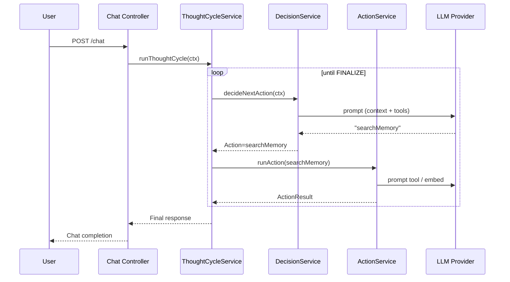

# PLANNING.md – SymbIA

> **Propósito**: documento de arquitetura e plano de ação para evoluir o agente **SymbIA** até um *LLM‑powered autonomous agent* capaz de **aprender, lembrar e agir** de forma genérica.

## 1. Visão Geral

SymbIA é dividido em duas aplicações:

* **API** (`/api`) – backend em Node + TypeScript que implementa o Thought Cycle, integra provedores LLM (Ollama) e armazena memórias no vetor store (Qdrant).
* **Web** (`/web`) – front‑end React utilizado como cliente de chat e painel de observabilidade.

O **ciclo Observe → Plan → Act → Reflect** é executado inteiramente no backend, permitindo que o agente:
1. decida autonomamente a próxima ação,
2. invoque ferramentas internas / externas,
3. grave novas memórias,
4. e finalize a interação quando apropriado.

## 2. Estrutura do Repositório

```
/
├── api/                    # Backend Node + TypeScript (Express‑like)
│   ├── src/
│   │   ├── actions/        # Atomic operations (Memory, Tool calls…)
│   │   ├── controllers/    # REST endpoints
│   │   ├── interfaces/     # Shared TS types
│   │   ├── models/         # Mongoose‑style data models
│   │   ├── providers/      # External connectors (LLM, Qdrant…)
│   │   │   ├── (LLM Provider)
│   │   │   │   (files)-prompt.ts   # All prompts used by the Provider
│   │   │   ├── vector-storage   # Qdrant…
│   │   ├── services/       # Business logic (Thought Cycle, LLM, Auth…)
│   │   └── routes/         # Express routers
│   └── package.json
├── web/                    # Front‑end Vite + React (chat client)
│   └── src/
├── docker-compose.yml      # One‑shot dev stack (api, db, qdrant, ollama)
└── docs/                   # Additional design docs
```

## 3. Stack & Ferramentas

| Domain             | Tech / Tool                     | Observações |
|--------------------|---------------------------------|-------------|
| **Backend**        | Node.js 20, TypeScript, Express | Projeto `api/` |
| **LLM Provider**   | Ollama (`llama3:8b`)            | Plugável via `LLMManager` interface |
| **Vector Store**   | Qdrant 1.9 (`agent_memory` coll.) | REST Client `@qdrant/js-client-rest` |
| **Embeddings**     | `nomic-embed-text` (⚠️ 768 dims) | Geração via `/embeddings` do Ollama |
| **Front-end**      | React 18 + Vite 5, TypeScript   | Projeto `web/`, UI de chat |
| **Containers**     | Docker / docker‑compose         | `api`, `qdrant`, `ollama`, `mongodb?` |
| **Testing**        | Vitest (planejado)              | **TBD** (ver seção *Quality*) |
| **Observability**  | OpenTelemetry (previsto)        | Middleware de tracing **TBD** |


## 4. Thought Cycle em Detalhe

### Ciclo de Pensamento do Agente

1. **Entrada (`chat.controller`)** – recebe `message` do usuário e monta `ThoughtCycleContext`.
2. **Plan (`decision.service`)** – LLM analisa contexto e devolve um `ActionType` (`saveMemory`, `searchMemory`, `finalize`…).
3. **Act (`action.service`)** – despacha para a classe `*.action.ts` correspondente e executa a tarefa.
4. **Reflect (`thought-cycle.service`)**
   * Anexa `ActionResult` ao `ctx.executedActions`.
   * Verifica critérios de finalização (`FINALIZE` ou *stuck loop*).
   * Caso não finalize, repete desde *Plan*.




## 5. Estratégia de Memória

### Estratégia de Memória

| Tipo           | Implementação atual | Próximos passos |
|----------------|---------------------|-----------------|
| **Curto Prazo**| Buffer de todas as mensagens na sessão | Criar `ShortTermMemoryManager` (20 msgs + TL;DR) |
| **Longo Prazo**| Qdrant coleção `agent_memory` (SAVE/SEARCH) – *placeholder* | Conectar embeddings reais & payloads (`episodic`, `procedural`) |
| **Reflexão**   | Não implementado | Job cron `ReflectAndWriteJob` promove insights |


## 6. Padrões de Código

### Padrões & Convenções Observados

* **Provider Pattern** – `LLMManager` seleciona dinâmico (`OllamaProvider`); `VectorStorageProvider` abstrato para Qdrant.
* **Action Encapsulation** – Cada operação é uma classe `*.action.ts`, injetada com `LLMManager`.
* **Service Layer** – `ThoughtCycleService`, `DecisionService`, `ActionService` isolam business rules.
* **Strict Typings** – Interfaces em `interfaces/` definem contratos (`ThoughtCycleContext`, `StreamChatProgress`…).
* **Composable Prompts** – Pastas `providers/ollama/*-prompt.ts` guardam system prompts separados do código.


## 7. Qualidade & Workflow

### Qualidade, Testes & CI/CD

| Item              | Status | Notas |
|-------------------|--------|-------|
| ESLint + Prettier | ✅ | Config em `web/.eslintrc.json` |
| Unit Tests (API)  | ⬜ | Planejado com Vitest |
| e2e “Learning”    | ⬜ | Ver prompt 11 |
| GitHub Actions    | ⬜ | Não configurado |


## 8. Configuração (.env)

### Variáveis de Ambiente (.env)

| Serviço | Chaves                                   |
|---------|------------------------------------------|
| API     | `PORT`, `QDRANT_URL`, `OLLAMA_URL`, `MONGO_URL` |
| Ollama  | `OLLAMA_MODELS_PATH` (opcional)          |
| Qdrant  | `QDRANT_API_KEY` (se habilitado)         |


## 9. Roadmap Imediato

### Roadmap Imediato

1. **Persistência Vetorial** – Implementar Prompts 1‑2 (Save/Search).
2. **Short‑term Memory & Reflexão** – Prompts 3‑4.
3. **Ferramentas Externas** – Prompts 5‑6 (JSON Schemas + CallTool).
4. **Observability** – Prompts 7‑8 (OTel + Redaction).
5. **Testes & Configuração** – Prompts 9‑12.


---

_Gerado em 2025-07-28 18:11 UTC_
